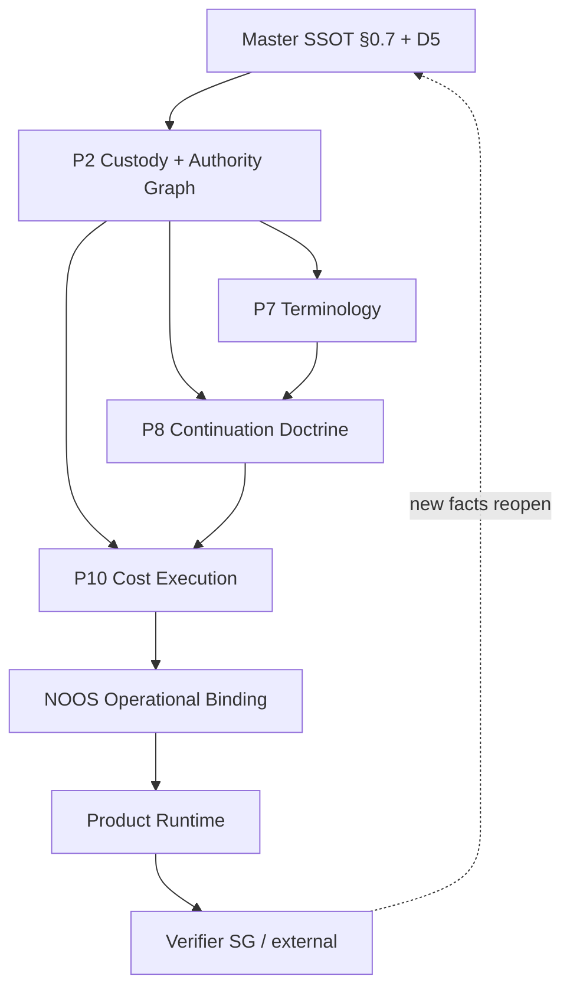

# AUTHORITY GRAPH — FOUNDER REASONING MOTOR — LOCKED v1

**Version:** v1.0.0_locked_20260710  
**Status:** LOCKED / RATIFIED  
**Authority:** Master SSOT §0.7, D5 motor plane  
**Companion:** `LIBRARY_CUSTODY_MATRIX_LOCKED_v1.md`  

---

## Authority graph



---

## Decision routing

| Situation | Authority | Actor |
|---|---|---|
| Reversible mechanical work | Motor automatic lanes | COST-T0 / COST-T1 / COST-T2 |
| Bounded API within cap | Motor + receipt | NOOS dispatch + runtime |
| Real ambiguity / hard architecture | Founder Reasoning Queue | Founder via subscription surface |
| Irreversible risk (money, legal, deploy, public claim) | Founder DECIDE (0.2) | Founder only |
| Proof of live/done/fixed | Verifier (D4) | Independent, author ≠ subject |
| Custody dispute | P2 custody matrix | SG spine; NOOS implements |

---

## Motor lane sequence (canonical)

```text
W-DET
→ W-INTEL-LOW
→ W-INTEL-BOUNDED
→ FOUNDER_REASONING_QUEUE
→ RESULT_INGESTION
→ automatic continuation
```

`FOUNDER_REASONING_QUEUE` **does not** invoke expensive models. It emits `FOUNDER_REASONING_PACKET` and sets `WAITING_FOR_FOUNDER_REASONING` on dependent jobs only.

---

## Four required integrator components (names only — spec in NOOS)

1. `ESCALATION_PACKET_BUILDER`
2. `FOUNDER_REASONING_QUEUE`
3. `MOBILE_REASONING_COCKPIT` / action interface
4. `REASONING_RESULT_INGESTOR`

Absence of any component = custody incomplete; do not claim full §0.7 compliance.

---

*v1.0.0_locked_20260710*
