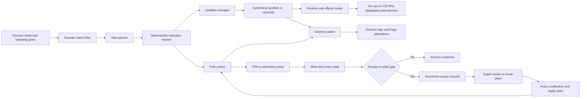
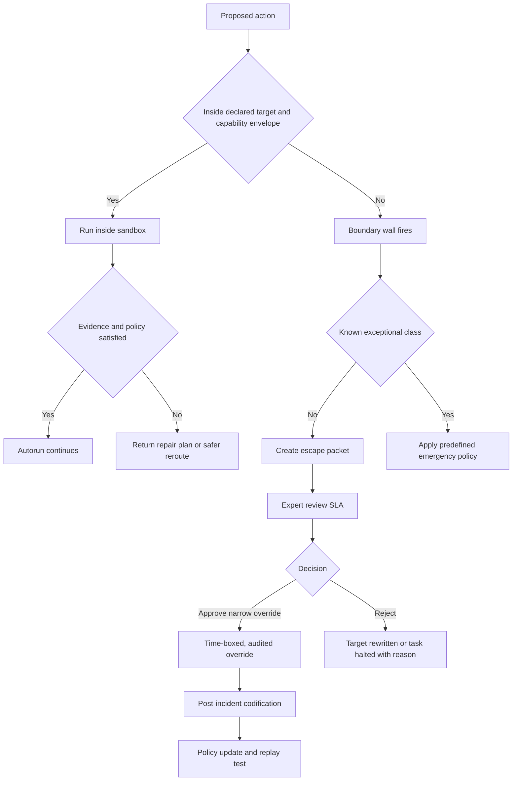

# Founder Intent Filter for Sandbox-First Autonomy

## Executive summary

This report designs a **Founder Intent Filter** for an autonomous, sandbox-first system whose operating goal is to reduce Sina’s manual involvement, keep autonomy inside machine-enforced boundaries, and move toward **deterministic autorun** as the default operating mode. The core design conclusion is that the filter should not behave like a human approval router. It should behave like a **policy compiler plus runtime classifier**: it converts founder intent into machine-checkable invariants, applies those invariants at sandbox admission, capability issuance, merge/deploy admission, and attestation verification, and escalates to a human only when the system is attempting to cross a defined boundary or when a policy gap is detected. This direction is consistent with primary-source guidance on decoupled policy engines, in-process admission control, auditable policy decisions, and layered sandboxing rather than ad hoc manual review. citeturn13view0turn13view1turn13view2turn13view3turn11view0turn12view4turn12view5

The three founder checks can be turned into precise machine heuristics. A control **passes** the first check only if it lowers expected future founder touches on the normal path and does not require Sina’s identity, judgment, or availability for ordinary execution. A control **passes** the second check only if it is a boundary wall: machine-enforced, continuously active, and triggered by policy violation or attempted escape rather than by routine work. A control **passes** the third check only if, when it denies action, it preserves progress by returning a narrower target, a safer reroute, or a repair plan rather than freezing the mission into a generic blocker. These heuristics are not present verbatim in the sources; they are the report’s synthesis of how admission control, policy-as-code, auditability, provenance, and deterministic build practice work when combined into an autonomy architecture. citeturn13view0turn13view3turn11view2turn16view0turn16view1turn18view3turn18view4

The most important redesign move is to **convert permission loops into machine-verifiable evidence checks**. In practice, that means replacing founder approvals, manual phase unlocks, and founder-specific merge/deploy gates with combinations of: ephemeral sandboxes; capability-scoped execution; signed provenance and attestation checks; protected branches with automated status checks; merge queues for busy branches; in-process validating admission; static or manifest-based policy loading for self-protection; and structured break-glass paths with full audit trails. GitHub’s own semantics already distinguish rule-enforced merge conditions, required reviewers, merge queues, environment protection rules, and deployment gates; Kubernetes distinguishes mutating versus validating admission and supports declarative CEL-based ValidatingAdmissionPolicy, plus manifest-based admission that is not editable through the API and is active from API server startup. Those are precisely the primitives needed to remove founder runtime from the normal path. citeturn17view2turn12view0turn11view4turn13view3turn11view0turn11view2

For sandbox-first execution, the strongest practical pattern is **layered isolation** instead of any single mechanism. Firecracker provides microVM isolation with container-like efficiency; gVisor reduces host-kernel attack surface by moving system interfaces into a per-sandbox application kernel; Linux seccomp reduces available syscalls but is explicitly not a complete sandbox on its own; Landlock restricts ambient filesystem and network rights for processes and future children; `no_new_privs` prevents gaining privilege across `execve`; and cgroup v2 constrains resource distribution hierarchically. NIST’s container security guidance likewise recommends reducing attack surface, grouping similar workloads, enforcing least privilege, and using container-aware runtime defense. citeturn12view5turn12view4turn13view6turn13view5turn13view7turn13view8turn9view0turn9view1turn8view3

The migration plan should be incremental and evidence-driven. Start by instrumenting current founder touches and running the filter in **shadow mode** so that it classifies controls without yet blocking anything. Then replace founder approvals with capability contracts and sandbox policies, convert merge/deploy gates to automated checks with provenance requirements, move high-value policies into static or startup-loaded form where appropriate, and reserve human reviews for anomaly cases, irreversible side effects, or explicit break-glass events. Deterministic autorun should be measured by replayability, identical plan hashes from identical inputs, reproducible build outputs where applicable, and shrinking founder touch rates over time. OPA bundles and decision logs, Kubernetes audit logs, and supply-chain attestations provide the evidence trail needed for both rollout and rollback. citeturn13view1turn13view2turn13view4turn12view1turn12view2turn16view1turn18view3turn18view4turn18view5

## Scope assumptions and north-star definitions

This report is intentionally limited to the **architect/advisor thinking layer**. It assumes that team size, stack, and risk tolerance are open-ended, so the design is framed as a portable reference architecture rather than as an implementation for a particular cloud, language, or repo host. The main operating assumptions are: Linux-capable execution; the ability to run ephemeral sandboxes; the ability to adopt policy-as-code and CI/CD attestation checks; moderate tolerance for reversible automation risk; low tolerance for unlogged, irreversible external side effects; and a desire to scale autonomy without making the founder the throughput bottleneck. Those assumptions align with the kinds of controls supported by OPA, Kubernetes admission, modern source-control protections, and reproducible or hermetic build systems. citeturn13view0turn13view3turn17view2turn16view0turn18view3turn18view5

In this report, a **Founder Intent Filter** is the policy layer that translates Sina’s strategic intent into machine-checkable decisions about whether a proposed action path is autonomy-expanding or autonomy-collapsing. The filter does not ask “would Sina approve this specific run?” It asks three narrower questions: whether the control reduces future founder work, whether it is a boundary wall rather than a permission loop, and whether it preserves an objective as a target instead of turning that objective into a blocker. This is a governance abstraction proposed here, but it is engineered using primary-source mechanisms that already exist: decoupled policy evaluation, validating admission, audit logging, and signed attestations. citeturn13view0turn13view2turn13view3turn12view2

A **sandbox-first** system means the normal execution path begins inside constrained execution environments with no ambient trust. That design is strongly supported by current sandboxing primitives. Firecracker microVMs provide VM-grade isolation with low overhead; gVisor inserts a per-sandbox application kernel to reduce container escape risk; seccomp filters syscalls to reduce exposed kernel surface; Landlock lets processes self-restrict ambient filesystem and network rights; `no_new_privs` blocks gaining privilege after `execve`; and cgroup v2 controls resource consumption hierarchically. NIST guidance further recommends minimizing container host attack surface, grouping containers by purpose and sensitivity, and using runtime defense tools. citeturn12view5turn12view4turn13view6turn13view5turn13view7turn13view8turn10view0turn9view0turn9view1

A **boundary wall** is a control that is always present but usually invisible. It permits routine work and fires only when execution tries to cross a policy boundary. Kubernetes validating admission is a good model: policies can be parameterized, scoped, and enforced with `Deny`, `Warn`, or `Audit` actions, while mutating webhooks are explicitly advised to fail open so they do not block compliant work during outages. Manifest-based admission deepens this model by making critical admission controls active at startup, independent of etcd, and not changeable through the Kubernetes API. citeturn13view3turn11view2turn11view0

A **permission loop** is the opposite pattern: work pauses during ordinary execution until a human approves it. GitHub’s required pull-request reviews, protected-branch settings, environment reviewers, and deployment protection rules are useful examples because they show where a platform can either keep humans off the hot path or place them directly on it. GitHub environments can require reviewer approval before a job proceeds, and protected branches can require reviews or passing checks before merge. Those are valuable controls in some contexts, but when mapped onto founder-autonomy goals they become permission loops if Sina is on the critical path for normal work. citeturn17view2turn11view4turn11view3

A **deterministic autorun** north star means that, given the same declared inputs, policies, and toolchain, the system should produce the same plan, the same policy decision trace, and—where build artifacts are involved—the same outputs or meaningfully equivalent outputs. Bazel defines hermeticity as returning the same output for the same input source and product configuration because the build is isolated from host changes. The Reproducible Builds definition raises the bar further to bit-for-bit identical artifacts given the same source, environment, and instructions. Nix similarly emphasizes isolated, reproducible, declarative systems and built-in rollback. citeturn18view3turn18view4turn18view5

## Founder checks as machine-evaluable heuristics

The most useful way to implement founder intent is as a **scoring model with hard fail conditions**. The table below defines the principal metrics. These metrics are a design proposal, but each was chosen so it can be backed by policy logs, audit trails, provenance, or replay tests. OPA decision logs, Kubernetes audit logs, supply-chain attestations, and merge/deploy events provide the raw evidence needed to compute them. citeturn13view2turn13view4turn12view1turn12view2turn20view1

| Metric | Definition | Desired direction | Primary evidence |
|---|---|---:|---|
| Founder touch rate | Founder touches on successful normal-path runs / all successful normal-path runs | Down to ~0 | workflow and audit logs |
| Founder specificity | Share of paths that require **Sina specifically**, not merely any authorized reviewer | Must be 0 on normal path | access policy + audit trail |
| Escape-trigger ratio | Denials caused by boundary crossings / all denials | High | policy decisions |
| Normal-path human-ack ratio | Human approvals required during compliant routine work / compliant routine work | Near 0 | pipeline events |
| Progress preservation rate | Denials that return an automatic reroute or repair plan / all denials | High | task outcomes |
| Replay stability | Identical plan hash or artifact hash across repeated runs with same inputs | High | replay tests, provenance |
| Override half-life | Median age of temporary overrides before removal or codification | Low | policy repo history |
| False-positive denial rate | Compliant actions denied / compliant actions attempted | Low | shadow-mode comparisons |

### Reduces Sina’s future workload vs makes Sina the runtime

A control passes the first founder check only if it **removes future founder work faster than it creates new founder work**. In practical terms, use three hard rules:

1. **No founder-specific identity on the normal path.** If successful routine operation requires Sina’s user account, approval click, personal key, or synchronous availability, the control fails.
2. **Positive workload delta over a rolling window.** If the expected founder minutes removed over the next 30 days are not greater than the founder minutes added by the control’s operation and maintenance, the control fails.
3. **Codification requirement.** If the same founder judgment is requested more than a defined small number of times, the system must convert that judgment into policy, parameters, or exemplars; otherwise the control fails as a recurring runtime dependency.

That logic is consistent with the separation between reviewable source controls and automated enforcement. GitHub branch protection, status checks, and merge queue semantics can keep branches protected without requiring a specific person on every merge. SLSA’s source track also distinguishes **continuous technical controls** from the stronger but narrower case of **two-party review**, which is intended for protected branches, not for every operational step in a system. citeturn17view2turn12view0turn16view0

A helpful operational rubric is:

- **Green**: any authorized role can satisfy the control, or no human is needed; Sina’s involvement is zero on the normal path.
- **Yellow**: human involvement exists, but not founder-specific, and is limited to protected-branch changes, high-risk deploys, or break-glass.
- **Red**: Sina is a required approver, secret holder, or merge/deploy operator for routine work.

This rubric is an inference from source-control and deployment-rule behavior rather than a direct quote from any single source. The reason it is sound is that the underlying platforms already support role-scoped review, app-scoped status checks, and automated merge/deploy conditions without founder-specific dependencies. citeturn17view2turn11view3turn11view4turn12view0

### Boundary wall vs permission loop

A control passes the second founder check only if it behaves like a **machine-enforced boundary wall**. Four decision heuristics make this test precise:

- **Trigger locus:** the control should evaluate at admission, capability issuance, side-effect execution, or post-hoc audit—not as a generic pause in normal work.
- **Escape conditionality:** the control should deny or escalate because an action exceeds declared capabilities, violates policy, lacks required evidence, or attempts to modify the control plane itself.
- **Compliant-path invisibility:** if a routine compliant action commonly waits for human acknowledgment, the control is a permission loop.
- **Bypass independence:** the control should not be mutable by the same ordinary API path it protects.

Kubernetes offers a particularly clean model. Validating admission is in-process and declarative; policies can `Deny`, `Warn`, or `Audit`; mutating webhooks are recommended to fail open so they do not reject compliant work during downtime; and manifest-based admission closes the bootstrap, self-protection, and etcd-dependency gaps by loading policies from disk at startup and making them unchangeable through the API. That is what a boundary wall looks like in practice. citeturn13view3turn11view2turn11view0

By contrast, controls like required deployment reviewers in a GitHub environment, founder-only environment approvals, or manual stage promotion are permission loops **unless** they are reserved for exceptional actions such as break-glass, irreversible external side effects above a threshold, or explicit production-risk classes. GitHub environments explicitly allow required reviewers and wait timers before jobs proceed, which is useful, but those controls should be treated as exception paths rather than the backbone of ordinary autonomy. citeturn11view4

### Keeps a target a target vs freezes it into a blocker

A control passes the third founder check only if denial yields **constrained progress**, not dead stop. This is the least common property in existing systems, so it should be enforced explicitly by policy design.

A denial is **target-preserving** when it returns one of the following:

- a narrower allowed target;
- a request for a missing artifact or attestation;
- a safe substitute action;
- a machine-generated remediation plan;
- an escalation packet with the minimum diff needed to cross the boundary.

A denial is **blocker-freezing** when it returns only “not allowed,” “await approval,” or “manual review required” without a machine-readable next step. OPA decision logs, Kubernetes audit events, and attestation verification results make it possible to attach structured reasons and recommended corrections to denials; the architecture should require that. Audit records should also contain the event type, time, place, source, outcome, and associated identity so that recurring blocker patterns can be codified away. citeturn13view2turn13view4turn20view1

The strongest practical heuristic is:

> **If a control denies, it must either auto-repair, auto-reroute, or auto-package an escape request.**

That rule turns policies from “stoppers” into “trajectory shapers.” It is also consistent with deterministic autorun: the system should be able to replay the same denied input and produce the same reason and the same next-step envelope. Hermetic and reproducible build practice shows why that determinism matters; repeatability is what makes debugging and trust possible. citeturn18view3turn18view4

## Control pattern catalog and redesign rules

The catalog below evaluates common control patterns against the three founder checks. The factual examples behind these patterns come from GitHub protected branches, rulesets, environments, and merge queues, plus Kubernetes admission control and SLSA source controls. GitHub supports required reviews, status checks, signed commits, linear history, merge queues, deployment-success rules, and environment reviewers; Kubernetes supports validating admission with `Deny`, `Warn`, and `Audit`, and manifest-based admission can protect the admission resources themselves; SLSA distinguishes continuous technical controls from two-party review on protected branches. citeturn17view2turn17view1turn17view0turn11view4turn12view0turn13view3turn11view0turn16view0

| Pattern | Typical intent | Default classification | Against check A | Against check B | Against check C | Recommended redesign |
|---|---|---|---|---|---|---|
| Founder approval before task start | Prevent bad launches | Permission loop | Fails if Sina is required | Fails; fires during normal work | Usually freezes | Remove from normal path. Replace with predeclared risk tier, task class, and sandbox capability contract. |
| Founder-only role gate | Centralize trust | Permission loop | Fails hard | Mixed, often weak | Usually freezes | Replace with machine identities, short-lived credentials, and role or app-scoped policies; eliminate founder-specific uniqueness. |
| Required PR reviews on protected branch | Source integrity | Can be valid boundary for source, not runtime | Usually passes if not founder-specific | Passes for protected-branch updates | Neutral | Keep only for protected branches or sensitive refs; never use founder as default reviewer for ordinary changes. |
| Manual merges by founder | Preserve branch health | Permission loop | Fails | Fails | Freezes | Turn on required checks, signed commits, protected branches, and merge queue; allow auto-merge once evidence is green. |
| Status checks before merge | Keep branch healthy | Boundary wall | Passes | Passes | Usually target-preserving if checks are actionable | Keep; ensure failures produce repairable diagnostics. |
| Merge queue | Preserve mainline while reducing contention | Boundary wall | Passes | Passes | Usually target-preserving | Prefer over manual queue management on high-velocity branches. |
| Environment-required reviewers for deploy | Protect production | Permission loop unless restricted to exceptions | Often fails if common | Usually fails on normal path | Often freezes | Use only for break-glass or irreversible risk tiers; replace routine promotion with attestation, smoke-test, and rollback-health checks. |
| Phase unlocks between plan/build/test/deploy | Gate progression | Usually permission loop | Often fails | Often fails | Often freezes | Convert to evidence-based transitions: attestation present, tests pass, rollback healthy, budget within bounds. |
| L5 review | Expert escalation | Valid only as exception path | Passes only if rare and non-founder-specific | Passes if escape-triggered | Passes if escalation packet is structured | Redefine as anomaly-triggered expert review with SLA and policy extraction afterward. |
| Deployment must succeed before merge | Prevent unreleasable changes | Boundary wall | Passes | Passes | Neutral to good | Keep, but ensure deploy target is automated staging by default rather than human-held environment approval. |
| Signed commits / provenance verification | Integrity evidence | Boundary wall | Passes | Passes | Good when denial explains missing evidence | Keep and couple to attestation verification, not to manual sign-off. |

Two patterns deserve special emphasis.

**Manual merges** are almost always a design smell in this context. GitHub merge queue exists precisely to maintain branch stability and automate merging into busy branches once required protections pass, without forcing each author to constantly rebase and wait again. That makes merge queue a model boundary wall: it preserves the target branch and reduces human coordination overhead. citeturn12view0turn17view2

**L5 review** should be treated as an organization-specific label for the highest-severity expert escalation path, not as a generic stage in all workflows. The right use case is when a run attempts an irreversible side effect above a defined budget, hits an unknown policy class, or needs a one-time break-glass action. In that form, it is no longer a permission loop. It becomes an escape-triggered exception handler, and its outputs should be minuted as structured evidence so repeated L5 cases become codified policies or new target classes. That recommendation is an inference, but it is supported by how attestation, auditing, and policy engines make rare exceptions legible and codifiable. citeturn13view2turn13view4turn12view2turn20view1

## Architecture and runtime design

A practical Founder Intent Filter needs four planes: **intent**, **execution**, **policy**, and **evidence**. The policy plane must be separate from the executor, consistent with OPA’s core design of decoupling policy decision-making from policy enforcement. The evidence plane must collect every key decision, because OPA decision logs, Kubernetes audits, and supply-chain attestations are what make escapes, overrides, and nondeterminism diagnosable rather than mysterious. citeturn13view0turn13view2turn13view4turn12view1turn12view2



### Sandboxing and isolation pattern

The execution plane should start from **least ambient privilege** and then add only the exact capabilities needed. A strong default stack is:

- Firecracker or equivalent microVM for hostile-code or multi-tenant isolation;
- gVisor for workloads where container ergonomics matter and the compatibility/performance tradeoff is acceptable;
- seccomp to reduce the syscall surface;
- Landlock to restrict filesystem and network ambient rights;
- `no_new_privs` to prevent privilege gain across `execve`;
- cgroup v2 to limit CPU, memory, and I/O budgets;
- short-lived credentials and no persistent host-mounted secrets.

No single component is sufficient. Seccomp explicitly says it is not a sandbox by itself; gVisor documents compatibility and resource-limit gaps; Firecracker’s jailer is a second line of defense but has had security advisories; and Linux kernel controls remain configuration-sensitive. The design implication is to prefer **defense in depth plus replayable policy** over faith in one mechanism. citeturn13view6turn12view4turn18view0turn12view5turn18view1turn18view2turn13view5turn13view7turn13view8

### Policy plane and enforcement model

The policy plane should be split into three layers.

The first layer is **admission policy**: whether a run, merge, deploy, or external side effect is even allowed. OPA is well-suited here because it decouples decision logic from enforcement and can evaluate arbitrary structured input using Rego. Kubernetes ValidatingAdmissionPolicy is a useful embedded model because it is declarative, in-process, parameterizable, and supports `Deny`, `Warn`, and `Audit`. For critical controls, manifest-based admission or other startup-loaded policy forms are preferable because they protect the control plane itself from ordinary API mutation. citeturn13view0turn13view3turn11view0

The second layer is **capability issuance**: even if a task is admitted, what exact filesystem, network, repo, deployment, or secret capabilities it gets. Landlock and seccomp can enforce local sandbox restrictions; GitHub rulesets, protected branches, and app-scoped checks can enforce repo constraints; attestation checks can enforce which artifacts are eligible for promotion. SLSA source provenance and protected named references provide the right model for source-side continuity, while in-toto attestations and Sigstore verification provide the right model for build and deployment evidence. citeturn13view5turn13view6turn17view2turn16view0turn12view1turn12view2turn14search15

The third layer is **evidence and audit policy**: every decision and escape must emit enough record content to reconstruct what happened. OPA decision logs include the queried policy, input, bundle metadata, and decision ID; Kubernetes auditing records a chronological set of security-relevant actions; NIST AU-3 says audit records should contain the event type, time, place, source, outcome, and associated identity. That exact schema should become the minimum evidence contract for the Founder Intent Filter. citeturn13view2turn13view4turn20view1

### Runtime behaviors and control semantics

The runtime should treat **merge**, **phase unlock**, **L5 review**, and **escape hatch** as distinct semantics.

For **merge**, the normal rule should be: protected branch, automated checks, signed or provenance-backed commits where appropriate, and queue-based integration for busy branches. GitHub already supports required reviews, status checks, signed commits, “require deployments to succeed before merging,” and merge queue. The founder filter should therefore classify manual founder merge as a red anti-pattern and convert it into an evidence gate. A human review can remain on protected branches if needed for source integrity, but the founder should never be the universal approver. citeturn17view2turn17view1turn12view0turn16view0

For **phase unlock**, the normal rule should be automatic promotion when evidence is satisfied: attestation verified, tests green, rollback healthy, budget and blast radius within class limits, and no policy violations. GitHub environments show how platforms implement manual wait states and reviewers; the filter should reserve those only for exceptional production-risk classes, not for every build or deploy. citeturn11view4

For **L5 review**, the normal rule should be **no L5**. L5 should trigger only when the system encounters an unclassified irreversible effect, a previously unseen policy class, a legal/compliance ambiguity, or a break-glass action. The output of L5 should not be “approved” or “rejected” in isolation; it should be a signed decision packet that either becomes a reusable policy, a one-time tightly scoped override with expiry, or a permanent “never allow” precedent.

For **escape hatches**, the system should never silently widen permissions. Instead it should emit a structured request that contains the denied capability, rationale, risk class, expected blast radius, proposed least-privilege delta, expiry, and replay reference. This mirrors how attestation and audit systems make claims verifiable and how boundary walls should fire only on attempted escape. citeturn12view2turn13view2turn20view1



### Failure modes and mitigations

The table below lists the highest-probability failure modes in this architecture and the preferred mitigation pattern. The behaviors are grounded in official documentation for webhook failure policy, sandbox limitations, audit logging, and policy bundles. citeturn11view2turn18view0turn18view2turn13view1turn13view2turn13view4

| Failure mode | What goes wrong | Why it matters | Mitigation |
|---|---|---|---|
| Policy engine outage | Routine work is blocked or policy becomes stale | Can turn a wall into a systemic blocker | Cache signed policy bundles locally; prefer in-process or startup-loaded policies for critical paths; use shadow mode before hard fail. citeturn13view1turn11view0turn13view3 |
| Mutating webhook downtime | Compliant requests rejected or inconsistent behavior | Permission-loop behavior from infra failure | Follow Kubernetes guidance: mutators fail open, validators enforce state. citeturn11view2 |
| Sandbox escape | Host compromise or credential theft | Breaks autonomy trust model | Layer microVM or gVisor with seccomp, Landlock, `no_new_privs`, cgroups, and isolated secret issuance. citeturn12view4turn12view5turn13view5turn13view6turn13view7turn13view8 |
| Isolation blind spots | gVisor or runtime compatibility gaps | Workloads fail or resource contention leaks through | Place the sandbox itself in host cgroups; compatibility-test critical workloads; use stronger isolation for untrusted code. citeturn18view0turn12view5 |
| Control-plane tampering | Critical policies are deleted or weakened | Boundary wall evaporates | Use manifest-based admission or out-of-band protected policy distribution for critical controls. citeturn11view0 |
| Nondeterministic builds or plans | Replay results differ | Autorun becomes untrustworthy | Pin toolchains, isolate network and host dependencies, and run replay checks against hashes and decision traces. citeturn18view3turn18view4turn18view5 |
| Audit blind spots | You cannot explain what happened | Recurring founder escalations never get codified | Standardize event content on AU-3 fields and centralize audit collection. citeturn20view1turn13view4turn13view2 |
| Founder override creep | Temporary exceptions become normal workflow | Sina becomes runtime again | Expiring overrides, mandatory post-incident codification, and monthly override review. |

## Migration, metrics, and validation

The migration should begin with **measurement, not enforcement**. The first milestone is to instrument the current system so that founder touches, approval pauses, denials, overrides, and escape requests are observable. Enable OPA decision logs where policies already exist, centralize audit records, and tag all founder interactions in the workflow history. Without this baseline, it is impossible to tell whether the filter is actually reducing founder runtime or merely relocating it. OPA decision logs and Kubernetes audit logs provide exactly the kind of event stream needed for this baseline, and NIST AU-3 gives the minimum content standard those logs should meet. citeturn13view2turn13view4turn20view1

The second milestone is **shadow-mode classification**. For several weeks, the Founder Intent Filter should classify each existing rule or approval step as green, yellow, or red against the three checks, but it should not yet change execution. This phase should identify where Sina is a unique dependency, where a control fires during normal work, and where denials lack repairable output. The result should be a ranked backlog of controls to remove, convert, or harden.

The recommended priority order is:

| Priority | Action | Why first |
|---|---|---|
| Highest | Remove founder-specific approvals from routine execution | Biggest direct reduction in founder runtime |
| Highest | Introduce sandbox capability contracts for common task classes | Converts ad hoc judgment into repeatable policy |
| High | Replace manual merges with protected branches, checks, and merge queue | High-frequency founder touch point with mature platform support |
| High | Introduce provenance and attestation checks for build/deploy | Replaces manual trust with machine-verifiable evidence |
| High | Convert manual phase unlocks to evidence-based transitions | Removes hidden permission loops |
| Medium | Formalize L5 review as anomaly-only expert escalation | Prevents review inflation |
| Medium | Move critical policies into startup-loaded or otherwise self-protecting form | Hardens boundary walls against tampering |
| Medium | Add deterministic replay harness and nightly rerun tests | Validates north star without forcing broad cutover |

The key **business metric** is not just approval count. It is **founder runtime substitution**: the amount of ordinary system throughput that still depends on Sina’s presence. A useful metric pack is:

| Metric | Definition | Suggested target after stabilization |
|---|---|---:|
| Founder touches per 100 normal-path runs | Count of founder actions needed for compliant routine work | < 1 |
| Founder-specific dependency rate | % of successful runs that require Sina specifically | 0% |
| Autonomous completion rate | % of routine runs completed without human intervention | > 95% |
| Escape rate | % of runs that triggered a structured escape request | Falling over time |
| Override half-life | Median days before temporary override expires or becomes policy | < 14 days |
| Policy false-positive rate | % of compliant runs denied in shadow comparison | < 1% before hard fail |
| Replay stability | % of same-input reruns yielding same plan hash / artifact hash | > 99% for scoped task classes |
| Mean founder minutes per week on operations | Tracked time spent as runtime operator | Declining month over month |

For **deterministic autorun** validation, the report recommends five test families.

First, run **same-input replay tests**: same inputs, same policy bundle version, same sandbox image, same secrets context, same network policy. Measure plan-hash stability and artifact-hash stability. Hermetic build guidance and reproducible-builds definitions make this the core diagnostic for uncontrolled ambient dependency. citeturn18view3turn18view4turn18view5

Second, run **policy determinism tests**: the same request should yield the same admit/deny/warn/audit result and the same structured reason from the same policy bundle. OPA bundles and decision logs make this directly measurable. citeturn13view1turn13view2

Third, run **control-plane resiliency tests**: bring down noncritical mutators, simulate stale bundle delivery, and verify that compliant work is still not blocked by mutator downtime. Kubernetes explicitly recommends mutators fail open and validators enforce state, which should shape these experiments. citeturn11view2

Fourth, run **sandbox escape and overbreadth drills**: attempt undeclared filesystem access, unauthorized network egress, forbidden syscalls, and privilege escalation. The expected result is deterministic denial with audit evidence, not partial success. This is where seccomp, Landlock, `no_new_privs`, and cgroups should prove their value. citeturn13view5turn13view6turn13view7turn13view8

Fifth, run **promotion-pipeline integrity tests**: verify that deployable artifacts without the required in-toto attestation, signatures, or provenance are denied automatically and that the denial returns a repair plan such as “rebuild with signed provenance” rather than “manual review required.” Sigstore’s attestation verification support and SLSA provenance requirements provide the foundation for this. citeturn12view2turn12view1turn16view1

Rollback strategy should mirror the migration pattern. Start with **audit-only or warn-only** policy where possible, then canary one repo, one deployment environment, or one task class, then expand. Keep previous signed policy bundles, previous sandbox images, and previous capability classes ready for fast revert. If a new policy causes widespread false positives, revert the bundle, keep the logs, and treat the incident as a policy-spec defect rather than as an operator failure. The combination of hot-loaded OPA bundles, audit logs, and declarative environments makes rapid rollback and forensics much easier than manual gatekeeping does. citeturn13view1turn13view2turn13view4turn18view5

## Decision matrix and example policy code

The decision matrix below is this report’s synthesis of how candidate controls behave when judged against founder workload, enforcement type, false-positive risk, developer friction, and implementation complexity. The qualitative ratings are grounded in the official behavior of GitHub branch protection, rulesets, environments, merge queue, Kubernetes admission, OPA, Linux sandboxing primitives, and supply-chain attestation tooling. citeturn17view2turn17view1turn11view4turn12view0turn13view3turn11view0turn13view0turn13view5turn13view6turn12view2

| Candidate control | Impact on founder workload | Enforcement type | False-positive risk | Developer friction | Implementation complexity | Recommended use |
|---|---|---|---|---|---|---|
| Founder approval per task | Very bad | Permission loop | Low technical, high organizational | Very high | Low | Remove |
| Founder-only deploy approval | Bad | Permission loop | Low technical, high organizational | High | Low | Restrict to break-glass only |
| Protected branch + automated checks | Strongly positive | Boundary wall | Medium | Medium | Medium | Keep |
| Merge queue | Positive on busy branches | Boundary wall | Low to medium | Low | Medium | Prefer on high-velocity protected branches |
| Required reviewers on protected branch | Mixed | Source-integrity boundary | Medium | Medium | Low to medium | Keep only where source integrity justifies it |
| Environment required reviewers | Negative if common | Permission loop | Low | High | Low | Exception-only |
| Signed commits | Positive | Boundary wall | Low | Low | Low | Keep |
| Attestation / provenance verify gate | Strongly positive | Boundary wall | Medium | Medium | Medium | Keep |
| Manifest-based admission for critical policy | Positive | Boundary wall | Low | Low | Medium to high | Use for self-protecting critical controls |
| OPA policy bundles + decision logs | Strongly positive | Boundary wall support | Medium | Low | Medium | Core control plane |
| Firecracker microVM | Positive | Boundary wall support | Low | Medium | Medium to high | Use for hostile or high-risk workloads |
| gVisor sandbox | Positive | Boundary wall support | Medium | Medium | Medium | Use when compatibility is acceptable |
| Landlock + seccomp + `no_new_privs` + cgroups | Positive | Boundary wall support | Medium | Medium | Medium | Baseline Linux hardening |
| L5 expert escalation | Mixed to positive if rare | Escape-only review | Low if rare | Medium | Medium | Keep as anomaly path only |

The policy examples below are illustrative pseudocode, not drop-in production snippets. They are meant to show how founder intent becomes machine-checkable logic using policy-as-code and attestation-aware control flow. OPA uses Rego for structured policy decisions, and Sigstore can verify in-toto attestations against Rego policies; Kubernetes ValidatingAdmissionPolicy uses CEL for in-process validation. citeturn13view0turn12view2turn13view3

### Boundary wall example

```rego
package founder_intent.boundary

default allow := false

# Input contract (illustrative)
# input = {
#   "action": "deploy",
#   "target": "prod",
#   "task_class": "service_release",
#   "actor": {"type": "machine", "principal": "ci-release-bot"},
#   "capabilities": ["repo:merge", "deploy:staging"],
#   "attestations": {
#     "source_provenance": true,
#     "build_provenance": true,
#     "signature_verified": true
#   },
#   "risk": {"irreversible": true, "blast_radius": "medium"},
#   "founder_required": false
# }

founder_runtime_dependency if {
  input.founder_required == true
}

missing_evidence[reason] if {
  not input.attestations.source_provenance
  reason := "missing_source_provenance"
}

missing_evidence[reason] if {
  not input.attestations.build_provenance
  reason := "missing_build_provenance"
}

missing_evidence[reason] if {
  not input.attestations.signature_verified
  reason := "missing_signature_verification"
}

outside_capability_envelope if {
  input.action == "deploy"
  input.target == "prod"
  not capabilities_allow_prod
}

capabilities_allow_prod if {
  "deploy:prod" in input.capabilities
}

requires_exception_review if {
  input.risk.irreversible
  input.target == "prod"
  input.risk.blast_radius == "high"
}

allow if {
  not founder_runtime_dependency
  count(missing_evidence) == 0
  not outside_capability_envelope
  not requires_exception_review
}
```

This example encodes the first and second founder checks directly. It denies founder-specific runtime dependency, denies missing evidence, and denies capability escape. It does **not** request Sina’s approval during ordinary compliant work. That matches the recommended use of decoupled policy engines, provenance evidence, and automated admission. citeturn13view0turn12view1turn12view2

### Escape-trigger example

```rego
package founder_intent.escape

default outcome := {"status": "deny"}

# Produce a structured escape packet instead of a dead stop.
outcome := {
  "status": "escalate",
  "reason": reasons,
  "class": "exception_review",
  "suggested_delta": suggested_delta,
  "expiry_hours": 24,
  "postmortem_required": true,
} if {
  some reasons
  reasons := collect_reasons
  not founder_specific_escalation
}

collect_reasons := rs if {
  rs := array.concat(
    [r | r := data.founder_intent.boundary.missing_evidence[_]],
    [r | data.founder_intent.boundary.outside_capability_envelope; r := "capability_escape"]
  )
}

suggested_delta := {
  "requested_capability": "deploy:prod",
  "narrow_scope": {"service": input.service, "environment": "prod"},
  "required_evidence": ["rollback_plan", "canary_plan", "verified_attestations"]
} if {
  data.founder_intent.boundary.outside_capability_envelope
}

founder_specific_escalation if {
  input.escalation_reviewer == "sina"
}
```

This snippet implements the third founder check. A deny becomes an **escalation packet with a repairable delta**, not an opaque blocker. It also enforces that the escalation path is not founder-specific. The design intent is consistent with auditable decision logs and attestation-based verification. citeturn13view2turn12view2turn20view1

### In-process admission example

```yaml
apiVersion: admissionregistration.k8s.io/v1
kind: ValidatingAdmissionPolicy
metadata:
  name: autonomy-boundary.example.com
spec:
  failurePolicy: Fail
  matchConstraints:
    resourceRules:
      - apiGroups: ["apps"]
        apiVersions: ["v1"]
        operations: ["CREATE", "UPDATE"]
        resources: ["deployments"]
  validations:
    - expression: "has(object.metadata.labels['attestation.signed'])"
      message: "Signed attestation label required."
    - expression: "!has(object.metadata.annotations['founder.approval.required'])"
      message: "Normal-path founder approvals are not allowed."
---
apiVersion: admissionregistration.k8s.io/v1
kind: ValidatingAdmissionPolicyBinding
metadata:
  name: autonomy-boundary-binding.example.com
spec:
  policyName: autonomy-boundary.example.com
  validationActions: [Deny, Audit]
```

This example uses Kubernetes’ documented policy model: declarative CEL expressions plus binding-scoped `Deny` and `Audit`. It is a good fit for “boundary wall” semantics because the rule is active at admission rather than as a manual pause later in the workflow. For the most critical controls, a startup-loaded or manifest-based form is stronger because it can protect the admission resources themselves from ordinary API mutation. citeturn13view3turn11view0

### Merge and phase-unlock semantics example

```yaml
merge_policy:
  protected_branch: main
  require_signed_commits: true
  require_status_checks: true
  require_merge_queue: true
  founder_as_required_reviewer: false
  allow_auto_merge_when_green: true

promotion_policy:
  staging_to_prod:
    requires:
      - verified_build_provenance
      - verified_source_provenance
      - smoke_tests_green
      - rollback_plan_present
      - blast_radius <= approved_budget
    on_failure:
      return:
        - repair_plan
        - safer_target: staging
        - canary_only_option
    manual_review_only_if:
      - irreversible_effect == true
      - policy_gap == true
      - break_glass == true
```

This pattern captures the report’s central recommendation: **automate the green path, structure the yellow path, and reserve humans for red-zone exceptions**. GitHub’s merge queue, protected branches, review rules, and deployment protections, together with provenance and attestation checks, make these semantics practical on modern platforms. citeturn12view0turn17view2turn11view4turn12view1turn12view2

The overall design recommendation is therefore straightforward:

- Keep a small number of **hard machine walls**.
- Make compliant work pass through them without human pauses.
- Convert recurring founder judgment into policy, parameters, or attested evidence.
- Require every denial to preserve trajectory.
- Treat deterministic replay and founder-touch reduction as the two primary success metrics.

That is the architecture most aligned with the stated goals: reduce Sina’s manual work, enable sandbox-first autonomy, enforce walls that fire only on escape, and make deterministic autorun the north star. citeturn13view0turn13view1turn13view2turn13view3turn11view0turn18view3turn18view4turn18view5