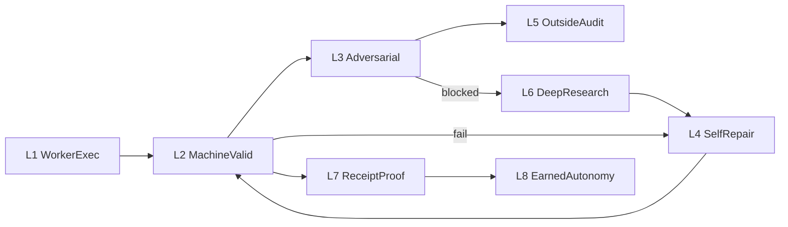

# Machine autonomy loops v1

**Status:** LOCKED — operating mode for all SG agents  
**Saved:** 2026-07-03  
**Authority:** SG (SSSOT)  
**Registry:** [data/machine_autonomy_loops_v1.json](../data/machine_autonomy_loops_v1.json)  
**Parent:** [PARALLEL_AUTOMATION_GOVERNANCE_v1.md](PARALLEL_AUTOMATION_GOVERNANCE_v1.md)

---

## 0. Default question

Before any proposal, escalation, or new motor:

> **How does the process solve this without Sina?**

If the answer is "ask the founder to check" — the design is incomplete. Replace with a loop, receipt, or registered motor.

---

## 1. Purpose

Founder triggers are **technical debt**. Validation, review, repair, audit, and uncertainty handling belong to **machine loops** with receipt proof. Sina retains only **minimum triggers** until streak receipts retire them.

---

## 2. Eight loops (always-on process)

| Loop | Solves without Sina | Existing motor / script |
|------|---------------------|-------------------------|
| **L1 Worker execution** | Venture builds in own repo | CF auto-runtime, loop specialist, NOOS factory |
| **L2 Machine validation** | Deterministic PASS/FAIL | `validate_parallel_automation_governance_v1`, drift audit, health check |
| **L3 Adversarial critique** | Second identity challenges PASS | CF advisory worker, SF trap tests, TF hardstop battery |
| **L4 Self-repair** | Known fixes before escalate | `repair_sourcea_worktree_v1`, brain self-heal, NOOS self-heal |
| **L5 Outside audit** | Independent read path | GitHub App + secondary CF account verifier |
| **L6 Deep research** | Structured uncertainty | NOOS researcher, observe loop, research receipt |
| **L7 Receipt proof** | Disk truth vs chat | All motors → `receipts/` schema |
| **L8 Earned autonomy** | Expand surface by streak | Gate alignment + PASS streak → phase/promote unlock |

---

## 3. One cycle (what runs without Sina)

Every brain-loop tick (Mac 30m / GH */30) should conceptually execute:

1. **L1** — Workers already ran on their cadence; SG **reads** venture receipts only.
2. **L2** — Run validation bundle (≤90s Mac-safe subset).
3. **L4** — If drift/worktree/health fail → apply repair script once.
4. **L2** — Re-validate.
5. **L3** — If promote candidate exists → trigger verifier batch (not founder).
6. **L5** — Verifier runs on secondary account; receipt written.
7. **L6** — If same blocker 3× → open research ticket (NOOS/sg observe doc), **not** founder chat.
8. **L7** — Emit cycle receipt with loop states.
9. **L8** — Evaluate streak counters; propose autonomy expansion as **receipt**, not ask.

**Orchestrator:** `scripts/run_machine_autonomy_cycle_v1.py` (SG)

---

## 4. Minimum founder triggers (until retired)

| ID | Class | Machine must try first | Retire when |
|----|-------|------------------------|-------------|
| FT-CAPITAL | Spend / paid tier | ROI heartbeat + throttle | Revenue event or 30d under cap |
| FT-LEGAL | Regulated send/claims | Trap battery + B2 JSON | 8× trap PASS + signed JSON |
| FT-L5-IRREVERSIBLE | Gate weaken, force-push | **Forbidden** — propose only | Never auto-retire |
| FT-PHASE-UNLOCK | Phase 2→3, live inbox | Checklist receipt ALL PASS | 5× (hygiene) or 8× (promote-class) streak |

Everything else — CI red, observe loop red, verifier BLOCKED, drift — is **L4 → L6**, not founder.

---

## 5. Escalation ladder (no founder by default)

| Stage | Action | Owner |
|-------|--------|-------|
| 0 | Detect | L2 validator |
| 1 | Repair once | L4 self-repair |
| 2 | Re-validate | L2 |
| 3 | Adversarial re-check | L3 verifier |
| 4 | Research ticket | L6 (hypothesis + evidence) |
| 5 | Assist-only PR | Copilot / Cursor draft |
| 6 | Freeze writes | Motor hold receipt |
| 7 | Founder | **Only** FT-CAPITAL / FT-LEGAL / FT-L5 / FT-PHASE |

---

## 6. Earned autonomy (L8)

Autonomy expands only on **receipt streaks**, never on chat approval.

| Transition | Requires |
|------------|----------|
| observe_only → promote_candidate | 3× verifier PASS + 3× drift PASS + gate ALIGNED |
| phase_N → phase_N+1 | 5× trap PASS + B2 signed + cost/signal < CAD 0.01 |
| assist_only → registered_motor | workflow audit PASS + no parallel conflict |

Expansion emits `receipts/earned-autonomy-expansion-*.json`. Phase unlock may still need FT-PHASE until streak retires it.

---

## 7. Agent rules (all lanes)

1. **Never** route "please check CI" or "please merge" to Sina — run L2/L4 or open PR.
2. **Never** report DONE without `receipt_id` (L7).
3. **Never** weaken L5 promotion gate — fix verifier path (L5/L6).
4. Proposals must include **which loop retires** any new founder trigger.
5. Mac founder session: L2 subset only (INCIDENT-039); full L3/L5 in cloud GH.

---

## 8. Retirement backlog (active)

| Founder debt | Machine replacement | Status |
|--------------|---------------------|--------|
| Manual merge PR #3 | GH merge when checklist PASS | ✅ retired |
| Manual observe env fix | NOOS workflow env map | ✅ committed — merge pending |
| Verifier deploy | `wrangler deploy` in CI post-merge | L4 — add GH workflow step |
| B2 sign-off | SG_SIGNED JSON | ✅ retired for TF Phase 2 |
| Promote gate | Verifier PASS streak | L3/L5 in progress |

---

## 9. Cross-links

- Motors: [github_automation_registry_v1.json](../data/github_automation_registry_v1.json)
- Surface: [automation_surface_inventory_v1.json](../data/automation_surface_inventory_v1.json)
- Ops: [MAC_CURSOR_OPS_v1.md](../docs/MAC_CURSOR_OPS_v1.md)
- Dispatch: [MAC_CURSOR_VENTURE_DISPATCH_v1.md](../docs/MAC_CURSOR_VENTURE_DISPATCH_v1.md)
